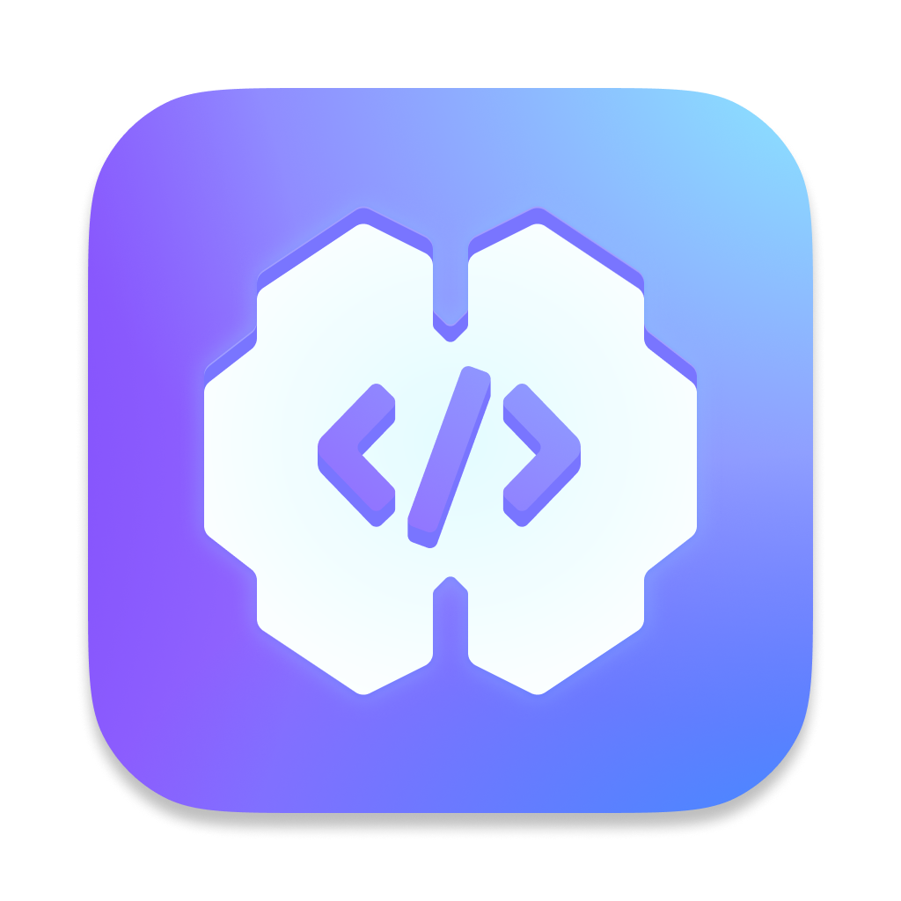
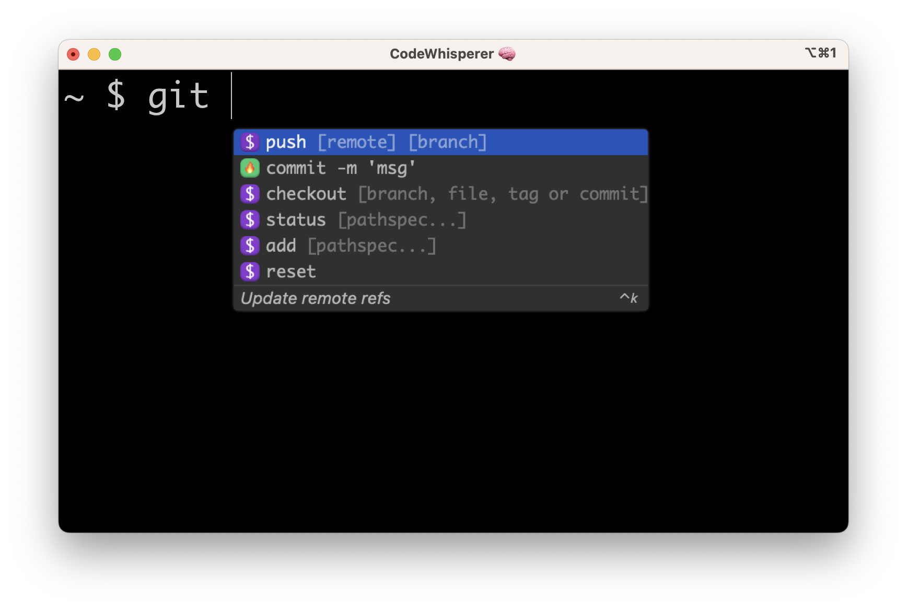

    
    <h2 style="margin-top: 0px">CodeWhisperer for command line - Discussions repo</h1>

[CodeWhisperer for command line](https://fig.io?ref=github_fig) makes the command line easier for beginners and more productive for advanced engineers. 

This repo hosts all [discussions](https://github.com/aws/codewhisperer-command-line-discussions/discussions) for bug reports, feature requests, announcements, and Q&A.

    

## ⚡️ Installation

Download for macOS [here](https://desktop-release.codewhisperer.us-east-1.amazonaws.com/latest/CodeWhisperer.dmg)

## Environment support
* Operating systems: macOS
* Shells: bash, zsh, fish
* Terminal emulators: iTerm2, macOS terminal, Hyper, Alacritty, Kitty, wezTerm
* IDEs: VS Code terminal, Jetbrains terminals (except Fleet)
* CLIs: 500+ of the most popular CLIs such as git, aws, docker, npm, yarn

## Bugs?
* Run `cw doctor` to self-heal common issues
* Run `cw restart` to see if restarting the app helps
* Run `cw issue` to create a new Discussion in this repo with pre-populated diagnostic information

## Feature request or questions?
Create a new Discussion [here](https://github.com/aws/codewhisperer-command-line-discussions/discussions/new/choose) 

## Docs
* [User guide](https://docs.aws.amazon.com/codewhisperer/latest/userguide/command-line.html)
* [Completion spec contribution](https://fig.io/docs)

## Other
Want AI coding suggestions in your IDE? Checkout https://aws.amazon.com/codewhisperer
