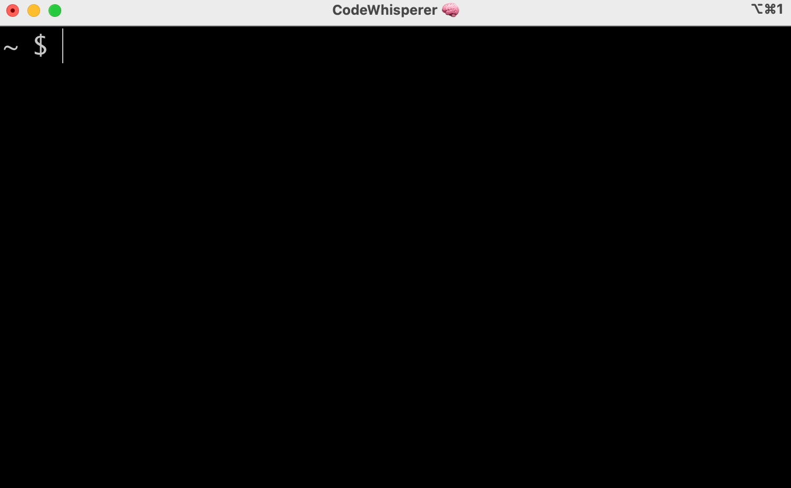

# This repo is no longer active, please create all issues going forward in [aws/amazon-q-developer-cli](https://github.com/aws/amazon-q-developer-cli)

    <h2 style="margin-top: 0px">Amazon Q for command line - Discussions repo</h1>

[Amazon Q for command line](https://aws.amazon.com/q/developer/) makes the command line easier for beginners and more productive for advanced engineers. 

This repo hosts all **[discussions](https://github.com/aws/q-command-line-discussions/discussions)** for bug reports, feature requests, announcements, and Q&A.

    

## ⚡️ Installation

Download for macOS [here](https://desktop-release.codewhisperer.us-east-1.amazonaws.com/latest/Q.dmg)

## Environment support
* Operating systems: macOS
* Shells: bash, zsh, fish
* Terminal emulators: iTerm2, macOS terminal, Hyper, Alacritty, Kitty, wezTerm
* IDEs: VS Code terminal, Jetbrains terminals (except Fleet)
* CLIs: 500+ of the most popular CLIs such as git, aws, docker, npm, yarn

## Bugs?
* Run `q doctor` to self-heal common issues
* Run `q restart` to see if restarting the app helps
* Run `q issue` to create a new Discussion in this repo with pre-populated diagnostic information

## Feature request or questions?
Create a new Discussion [here](https://github.com/aws/q-command-line-discussions/discussions/new/choose) 

## Docs
* [User guide](https://docs.aws.amazon.com/amazonq/latest/qdeveloper-ug/command-line.html)
* [Completion spec contribution](https://fig.io/docs)
